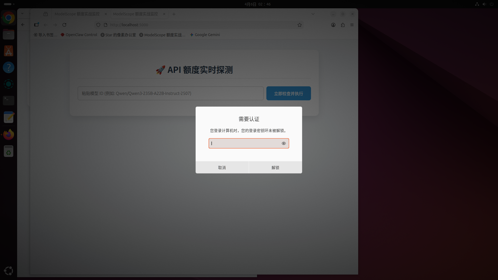

# 🔍 ModelScope 额度监控



一个轻量级 Flask Web 应用，用于实时探测 **魔搭社区（ModelScope）** API 的模型限额与账号额度。

## ✨ 功能

- 输入任意模型 ID，即时查看该模型的**当日限额与剩余额度**
- 同时显示**账号级总额度**使用情况
- 测试 API 连通性，返回模型响应预览
- 简洁美观的 Web 界面，局域网可访问

## 🚀 快速开始

### 1. 克隆项目

```bash
git clone https://github.com/deepvoce/modelscope-monitor.git
cd modelscope-monitor
```

### 2. 配置 API Key

从 [ModelScope 官网](https://modelscope.cn) 获取你的 Access Token，然后通过环境变量配置：

```bash
export MS_API_KEY="your_modelscope_token_here"
```

### 3. 安装依赖 & 启动

```bash
# 方式一：直接安装
pip install -r requirements.txt

# 方式二：使用虚拟环境（推荐）
python3 -m venv venv
source venv/bin/activate
pip install -r requirements.txt

# 启动应用
python app.py
```

### 4. 访问

浏览器打开 `http://localhost:5000`，输入模型 ID（如 `Qwen/Qwen3-235B-A22B-Instruct-2507`）点击查询即可。

## 📋 支持的响应头

| Header | 含义 |
|--------|------|
| `modelscope-ratelimit-model-requests-limit` | 该模型当日总请求限额 |
| `modelscope-ratelimit-model-requests-remaining` | 该模型当日剩余请求数 |
| `modelscope-ratelimit-requests-limit` | 账号当日总请求限额 |
| `modelscope-ratelimit-requests-remaining` | 账号当日剩余请求数 |

## 🔧 部署

### 通过 systemd 服务（Linux）

```bash
# 复制并修改 service 文件
cp modelscope-monitor.service ~/.config/systemd/user/
# 修改其中的 WorkingDirectory 和 User

# 启动并设为开机自启
systemctl --user daemon-reload
systemctl --user enable modelscope-monitor.service
systemctl --user start modelscope-monitor.service
```

### Docker（后续可加）

待补充。

## ⚙️ 环境变量

| 变量名 | 说明 | 默认值 |
|--------|------|
| `MS_API_KEY` | ModelScope API Token | 空（必须配置） |

## ⚠️ 注意事项

- 确保服务器能访问 `api-inference.modelscope.cn`
- **不要把 API Key 硬编码在代码中**，请通过环境变量配置
- 默认监听 `0.0.0.0:5000`，生产环境建议使用 Nginx 反向代理
- Flask 开发服务器不适合生产部署，建议使用 Gunicorn 等 WSGI 服务器

## 📝 许可证

MIT
